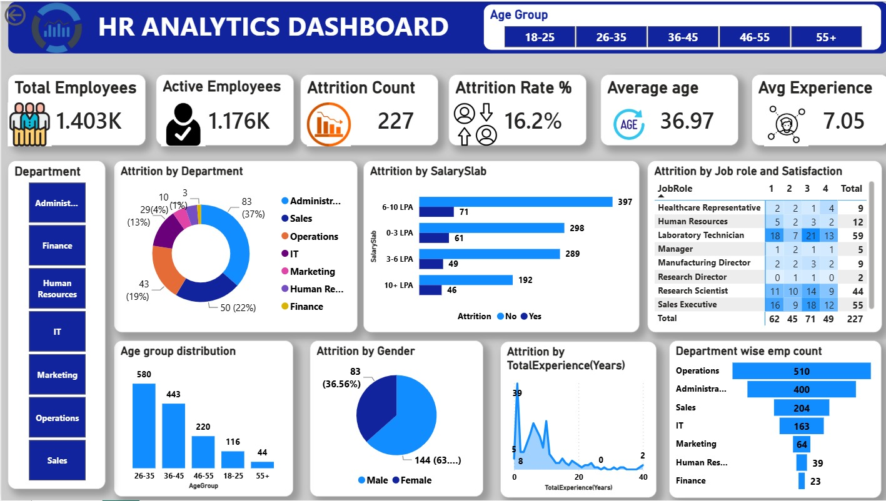

# 👥 HR Analytics Dashboard

An interactive **HR Analytics Dashboard** built using **Microsoft Power BI** to analyze employee attrition, workforce demographics, and key HR metrics. The dashboard provides meaningful insights into workforce trends, helping organizations make informed, data-driven HR decisions.

---

## 📊 Dashboard Preview

---

## 🚀 Features

- 👥 Employee Overview
- 📉 Employee Attrition Analysis
- 🏢 Department-wise Attrition
- 💰 Salary Slab Analysis
- 👨‍💼 Job Role & Satisfaction Analysis
- 📊 Age Group Distribution
- 🚻 Gender-wise Attrition
- ⏳ Experience-wise Attrition
- 📌 Department-wise Employee Count
- 🎛️ Interactive Filters & Slicers

---

## 📈 Key Metrics

- Total Employees
- Active Employees
- Attrition Count
- Attrition Rate (%)
- Average Employee Age
- Average Years of Experience

---

## 💡 Key Insights

- Identified departments with the highest employee attrition.
- Analyzed the relationship between salary slabs and attrition.
- Compared employee satisfaction across different job roles.
- Evaluated workforce demographics based on age and gender.
- Tracked employee experience distribution and retention patterns.
- Enabled interactive filtering for deeper HR analysis.

---

## 🛠️ Technologies Used

- Microsoft Power BI
- Power Query
- DAX
- Data Modeling
- Data Visualization

---

## 📂 Files Included

- `HR_dashboard.pbix` – Power BI Dashboard
- `HR_Analytics-4.csv` – Dataset
- `HR.jpg` – Dashboard Preview

---

## 🎯 Project Objective

The objective of this project is to transform raw HR data into meaningful business insights using Power BI. The dashboard helps HR professionals monitor workforce trends, identify factors influencing employee attrition, and support strategic decision-making through interactive visualizations.

---

## 👩‍💻 Author

**Aity Prachetha**

B.Tech – Computer Science & Artificial Intelligence

GitHub: https://github.com/AityPrachetha

---

⭐ If you found this project useful, consider giving this repository a **Star**.
